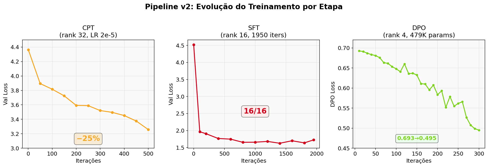
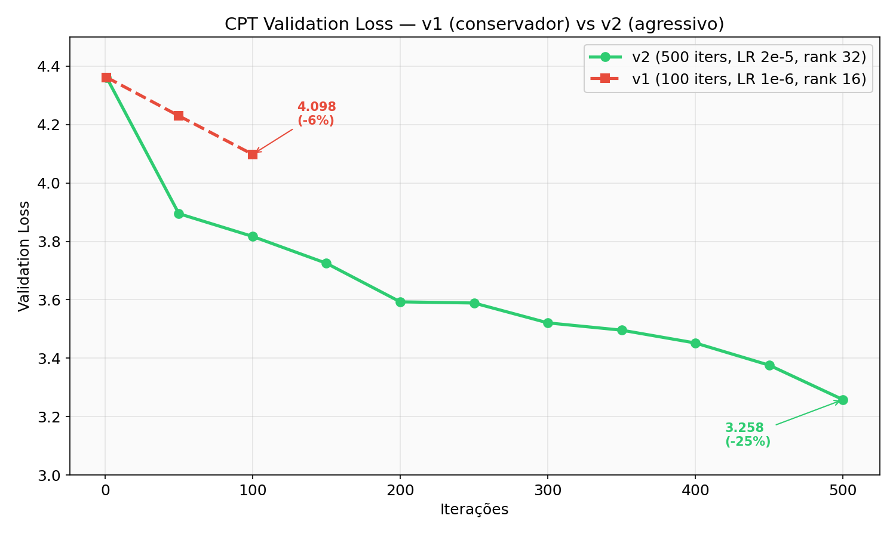
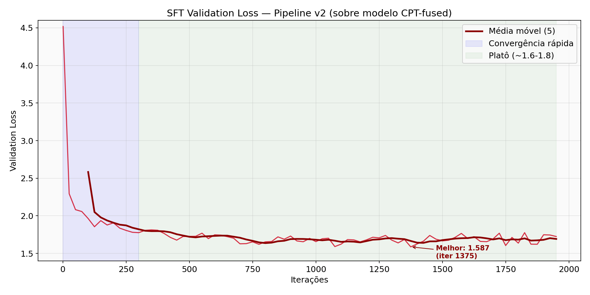
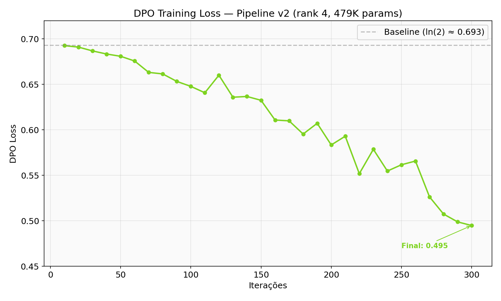
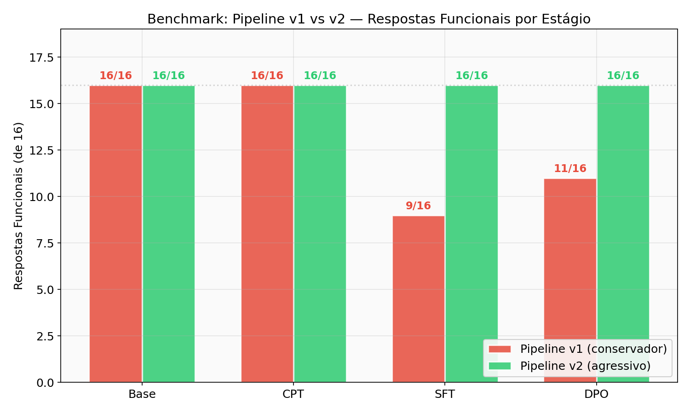
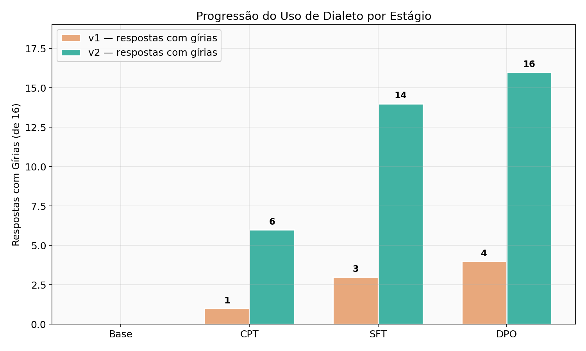
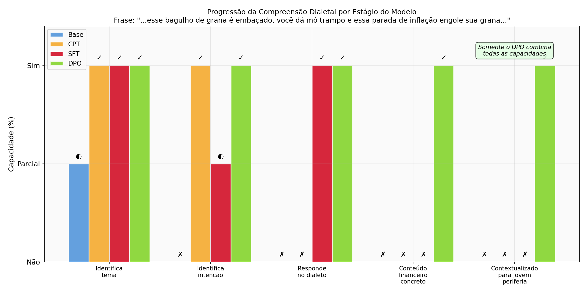

# Mlk de Vila: Fine-Tuning de LLMs para Educação Financeira no Dialeto da Periferia Brasileira

<p align="center">
  <strong>🇧🇷 Um LLM open source treinado para falar a língua da periferia</strong>
</p>

<p align="center">
  <a href="#1-introdução">Paper</a> •
  <a href="#quick-start">Quick Start</a> •
  <a href="#estrutura-do-projeto">Estrutura</a> •
  <a href="#resultados">Resultados</a> •
  <a href="#licença">Licença</a>
</p>

---

## Quick Start

### Requisitos
- Python 3.10+
- Hardware: 8GB de memória, GPU integrada, processador ARM (testado em Apple Silicon)
- Framework: [MLX](https://github.com/ml-explore/mlx)

### Instalação

```bash
git clone https://github.com/LeviBertolino/MLK-De-Vila.git
cd MLK-De-Vila
python -m venv .venv
source .venv/bin/activate
pip install mlx-lm gradio
```

### Demo Conversacional (Gradio)

```bash
python app.py
```

### Pipeline Completo (CPT → SFT → DPO → Benchmark)

```bash
bash scripts/run_full_pipeline.sh
```

---

## Estrutura do Projeto

```
MLK-De-Vila/
├── scripts/
│   ├── 00_clean_transcripts.py       # Limpa transcrições VTT
│   ├── 00_prepare_cpt_data.py        # Prepara dados CPT
│   ├── 00_cpt_train.py               # Treina CPT
│   ├── 01_generate_sft_data.py       # Gera dados SFT
│   ├── 02_generate_dpo_data.py       # Gera dados DPO
│   ├── 03_sft_train.py               # Treina SFT
│   ├── 04_dpo_train.py               # Treina DPO
│   ├── 05_benchmark.py               # Benchmark dual
│   ├── test_interpretability.py      # Teste de interpretabilidade
│   ├── test_dialect_comprehension.py # Teste de compreensão dialetal
│   └── run_full_pipeline.sh          # Pipeline completo
├── data/
│   ├── raw/youtube/                  # 99 transcrições VTT
│   ├── raw/artigos/                  # Artigos e pesquisas
│   ├── cpt/                          # Dados CPT (train/valid)
│   ├── instruction/                  # Dataset SFT (564 pares)
│   ├── preference/                   # Dataset DPO (564 pares)
│   └── sft_chat/                     # Dados SFT em formato chat
├── configs/
│   ├── lora_config.yaml              # SFT config (rank 16)
│   └── lora_config_cpt.yaml          # CPT config (rank 32)
├── results/                          # Benchmarks e testes
├── assets/                           # Gráficos do paper
├── app.py                            # Demo Gradio
└── README.md                         # Este documento (paper)
```

> **Nota:** Os pesos dos modelos (`models/`) e adapters (`adapters/`) não estão incluídos no repositório por questão de tamanho (~9.5GB). Para reproduzir, execute o pipeline completo.

---

# Paper

**Autores:** Levi Bertolino et al.

**Resumo:** Este trabalho investiga a viabilidade de adaptar modelos de linguagem de pequeno porte para operar no dialeto da periferia brasileira, com foco em educação financeira para crianças e jovens atendidos por ONGs. Um aspecto central é demonstrar que esse treinamento é viável com recursos computacionais acessíveis, um computador com 8GB de memória, GPU integrada e processador ARM, compatíveis com a realidade econômica das comunidades periféricas. Avaliamos o fine-tuning (CPT+SFT+DPO) como abordagem para internalização de aspectos culturais e linguísticos, demonstrando por que abordagens baseadas em recuperação (RAG) são estruturalmente incapazes de produzir esse resultado. Após duas iterações do pipeline, demonstramos que o Continuous Pre-Training com hiperparâmetros agressivos, combinado com SFT e DPO, consegue superar a resistência do alignment e produzir respostas genuinamente no dialeto da periferia, usando gírias como "trampo", "grana", "bico" e "mano" de forma natural e contextualizada. Além de gerar respostas no dialeto, avaliamos a capacidade do modelo de *compreender* frases compostas quase inteiramente por gírias, revelando uma progressão de interpretabilidade ao longo das etapas do pipeline.

**Palavras-chave:** LLM, fine-tuning, LoRA, DPO, dialeto, periferia, educação financeira, MLX

---

## 1. Introdução

A educação financeira é uma necessidade crítica nas comunidades periféricas do Brasil, onde a falta de acesso a informações financeiras claras e culturalmente relevantes perpetua ciclos de endividamento e exclusão econômica. Embora existam materiais educacionais de qualidade, a maioria é produzida em linguagem formal, distante da realidade comunicativa dessas comunidades. Quando um jovem da periferia diz "Parça, to colando para goma, hoje o bagulho tá loko", ele está dizendo "Amigo, estou indo para casa, hoje as coisas estão difíceis", mas nenhum modelo de linguagem disponível hoje compreende essa frase em suas múltiplas camadas de significado.

O dialeto da periferia brasileira, com suas gírias ("mano", "trampo", "grana", "quebrada"), estruturas sintáticas próprias e referências culturais específicas, não é simplesmente uma versão "incorreta" do português. É um sistema linguístico completo que carrega identidade, pertencimento e formas únicas de expressar conceitos complexos. Quando um educador financeiro explica que "a correria do dia a dia come a grana se tu não ficar ligado", essa mensagem ressoa de forma que "a falta de planejamento financeiro corrói o patrimônio" jamais conseguiria.

Este trabalho propõe o "Mlk de Vila" um modelo de linguagem fine-tuned para ser um educador financeiro que fala a língua da periferia. Investigamos duas questões centrais:

> **1. É possível treinar um LLM que não apenas *use* gírias, mas *compreenda* frases compostas quase inteiramente por dialeto da periferia?**
>
> **2. Esse treinamento pode ser realizado com recursos computacionais acessíveis à realidade econômica da periferia?**

A escolha de hardware acessível (8GB de memória, GPU integrada, arquitetura ARM) não é uma limitação, é uma decisão de design intencional. Se a tecnologia não pode ser reproduzida com recursos acessíveis à comunidade que pretende servir, ela não serve a essa comunidade. Demonstramos que é possível treinar um modelo completo (CPT → SFT → DPO) nesse hardware, com pico de memória de 5.08 GB.

Nossa hipótese é que o fine-tuning (CPT + SFT + DPO) permite ao modelo *internalizar* a cultura em camadas — primeiro o vocabulário e as estruturas (CPT), depois o conteúdo correto (SFT), e finalmente a preferência estilística (DPO). Para testar essa hipótese, avaliamos a progressão do modelo em quatro estágios:

1. **Modelo Base** — Gemma 3 1B IT sem modificações
2. **CPT** — Continuous Pre-Training em texto bruto do dialeto
3. **SFT** — Supervised Fine-Tuning com dados de educação financeira no dialeto
4. **DPO** — Direct Preference Optimization favorecendo o dialeto

### 1.3 Por que não RAG?

Uma abordagem alternativa seria Retrieval-Augmented Generation (RAG) — manter o modelo base e fornecer documentos no dialeto como contexto. Argumentamos que RAG é estruturalmente inadequada para adaptação dialetal por três razões:

1. **RAG opera no nível do conteúdo, não do estilo.** O modelo base gera texto em português formal independentemente do contexto recuperado. Fornecer exemplos de gírias no prompt não altera os pesos do modelo, ele continua produzindo texto no estilo do alignment original. Nossos experimentos confirmam isso: mesmo com system prompts explícitos instruindo o uso de gírias, o modelo base mantém o estilo formal (Seção 5.2).

2. **Compreensão requer representação interna, não consulta externa.** Para que o modelo entenda que "trampo" significa "trabalho" e use essa palavra naturalmente em contexto, essa associação precisa estar codificada nos pesos da rede neural, no espaço de embeddings e nas camadas de atenção. RAG não modifica pesos, portanto, não pode criar compreensão linguística.

3. **Dialeto é generativo, não recuperável.** Um falante da periferia não consulta um dicionário de gírias, ele gera linguagem naturalmente a partir de representações internalizadas. Da mesma forma, um modelo que realmente fala o dialeto precisa ter essas representações nos seus pesos, não em um banco de dados externo.

### 1.1 Contribuições

- Documentação completa de um pipeline de fine-tuning em hardware acessível (8GB de memória, GPU integrada)
- Análise da resistência de modelos instruction-tuned à mudança de estilo linguístico e como superá-la
- Descoberta de bugs críticos no tokenizer Gemma 3 (`<end_of_turn>` não é EOS) e na interação entre `mask_prompt` e system messages
- Benchmark dual (perguntas formais e em dialeto) para avaliar internalização cultural
- Dataset de educação financeira no dialeto da periferia brasileira
- Evidências de que CPT agressivo + SFT limpo + DPO é capaz de internalizar dialeto em modelo IT de 1B parâmetros

---

## 2. Trabalhos Relacionados

### 2.1 Fine-Tuning de LLMs com LoRA

Low-Rank Adaptation (LoRA) [Hu et al., 2021] permite o fine-tuning eficiente de grandes modelos de linguagem ao treinar apenas matrizes de baixo rank inseridas nas camadas de atenção. Isso reduz drasticamente os requisitos de memória, tornando viável o treinamento em hardware consumer.

### 2.2 DPO para Alinhamento

Direct Preference Optimization (DPO) [Rafailov et al., 2023] simplifica o alinhamento de preferências ao eliminar a necessidade de um modelo de recompensa separado, otimizando diretamente a política do modelo com base em pares de preferência (chosen/rejected).

### 2.3 Adaptação Linguística e Cultural de LLMs

Trabalhos recentes têm explorado a adaptação de LLMs para línguas e dialetos de baixo recurso. No entanto, a adaptação para *dialetos informais dentro de uma mesma língua* — como o dialeto da periferia brasileira — permanece pouco explorada. Este trabalho contribui para preencher essa lacuna.

### 2.4 Internalização vs Recuperação em Adaptação Linguística

A distinção entre internalizar conhecimento nos pesos de um modelo (fine-tuning) e recuperar informação em tempo de execução (RAG) é central para adaptação dialetal. Enquanto RAG é eficaz para domínios onde o conhecimento é factual e atualizável (bases de dados, documentação), a adaptação de *estilo linguístico* requer modificação das representações internas do modelo — uma tarefa que apenas o fine-tuning pode realizar.

---

## 3. Metodologia

### 3.1 Hardware e Framework

Todos os experimentos foram conduzidos em:
- **Hardware:** Computador com processador ARM, GPU integrada e 8GB de memória unificada
- **Framework:** MLX (Apple), otimizado para processadores ARM com GPU integrada
- **Formato:** bf16 (brain float 16)

A escolha de hardware com apenas 8GB de memória é intencional, demonstramos que o treinamento completo de um LLM adaptado para o dialeto da periferia é viável em hardware acessível. O pipeline completo (CPT + SFT + DPO + benchmark) executa em ~4 horas com pico de memória de 5.08 GB, dentro do que é possível com equipamentos disponíveis em associações dentro das comunidades, escolas públicas e centros comunitários. Essa acessibilidade é fundamental, se a ferramenta não pode ser treinada e mantida pela comunidade que serve, ela se torna dependente de infraestrutura externa.

### 3.2 Escolha do Modelo Base

A seleção do modelo passou por duas fases:

**Fase 1 — Qwen3 1.7B:** Primeiro modelo testado. Embora funcional para SFT, apresentou instabilidade severa no DPO, com colapso de geração (loops repetitivos tipo "receita receita receita") em todos os checkpoints testados, independentemente de hiperparâmetros.

**Fase 2 — Gemma 3 1B IT:** Modelo final selecionado (`mlx-community/gemma-3-1b-it-bf16`, ~2.6GB). Escolhido por:
- Melhor qualidade em português
- Menor tamanho (1B vs 1.7B), permitindo mais margem de memória
- Suporte robusto ao chat template no MLX
- Pico de memória durante treino: ~3.7GB (dentro do limite de 8GB)

Também avaliamos o Gemma 3 4B, mas o pico de memória estimado (~7.4GB) tornaria o treinamento inviável em 8GB.

### 3.3 Pipeline de Treinamento

O pipeline final é composto por quatro etapas:

```
Dados Brutos → CPT → SFT → DPO → Modelo Final
                ↓       ↓       ↓
           Dialeto   Conteúdo  Preferência
           (COMO)    (O QUE)   (QUAL)
```

#### 3.3.1 Continuous Pre-Training (CPT)

**Objetivo:** Ensinar o modelo a *falar* como a periferia antes de ensinar *o que* falar.

**Dados:**
- 99 transcrições de vídeos YouTube sobre educação financeira para periferia (~250k tokens)
- 8 artigos sobre educação financeira e cultura da periferia
- 16 textos sintéticos de situações do cotidiano em dialeto pleno
- 20 frases de gírias em contexto financeiro
- Total: 264 chunks após data augmentation (duplicação de chunks com gírias)

**Configuração (Pipeline v1 — conservador):**
- LoRA rank 16, scale 10.0, 8 camadas
- Learning rate: 1e-6, 100 iterações
- Resultado: val loss 4.362 → 4.098 (redução de 6%) — efeito insignificante

**Configuração (Pipeline v2 — agressivo, final):**
- LoRA rank 32, scale 20.0, 10 camadas (10M parâmetros treináveis)
- Learning rate: 2e-5, 500 iterações (~2.1 épocas)
- Max sequence length: 1024
- Sem `--mask-prompt` (treina em todo o texto)
- Gradient checkpointing habilitado
- Resultado: val loss 4.362 → 3.258 (redução de 25%)

**Nota sobre `alpha`:** Descobrimos que o mlx-lm ignora o parâmetro `alpha` do LoRA — apenas `rank`, `scale` e `dropout` são lidos. O parâmetro efetivo de escala é controlado diretamente por `scale`.

#### 3.3.2 Supervised Fine-Tuning (SFT)

**Objetivo:** Ensinar o modelo *o que* responder sobre educação financeira, no formato pergunta-resposta.

**Dados:** 564 pares instrução-resposta gerados sinteticamente cobrindo:
- 94 temas de educação financeira (inflação, juros, investimento, orçamento, etc.)
- 64 gírias da periferia integradas naturalmente nas respostas
- Qualidade verificada: 97.9% das respostas contêm gírias

**Configuração:**
- LoRA rank 16, scale 10.0, 12 camadas
- Learning rate: 1e-5
- 1950 iterações (reduzido de 2000 para evitar overfitting — ver Seção 5.4)
- Max sequence length: 1024
- `--mask-prompt` ativado (treina apenas na resposta do assistente)
- Filtragem de dados: respostas vazias ou com menos de 50 caracteres removidas (6 exemplos descartados)

**System prompt (usado no treino, NÃO na inferência — ver Seção 5.2):**
> "Você é o 'Mlk de Vila', um educador financeiro que fala a língua da periferia. Explica finanças de forma simples, direta e usando exemplos do dia a dia. Usa gírias como mano, parceiro, trampo, grana, padoca, bico. É motivador e honesto."

**Nota crítica sobre system message:** Descobrimos que usar system message durante a inferência (benchmark) causa geração imediata de `<end_of_turn>` no SFT. Isso ocorre porque `--mask-prompt` impede o modelo de aprender a associação entre system message e estilo de resposta, o modelo só vê o sistema+pergunta como contexto mascarado. Na inferência, sem a mesma system message, o modelo funciona normalmente. Ver Seção 5.2 para análise detalhada.

#### 3.3.3 Direct Preference Optimization (DPO)

**Objetivo:** Refinar as preferências do modelo, favorecendo respostas com dialeto sobre respostas formais.

**Dados:** 564 pares de preferência:
- **Chosen:** Resposta com gírias e linguagem da periferia (99.5% com gírias)
- **Rejected:** Mesma resposta em linguagem formal (19.9% com gírias — apenas as presentes no vocabulário padrão)

**Configuração:**
- LoRA rank 4, alpha 8, 4 camadas (479K parâmetros treináveis)
- Learning rate: 1e-6
- Beta: 0.3
- 300 iterações com shuffle por época
- Gradient clipping: max_norm=1.0

**Nota sobre capacidade:** Configurações mais agressivas (rank 16, 12 camadas, 5.75M parâmetros) causaram colapso imediato da loss (Seção 5.2).

### 3.4 Dados

#### 3.4.1 Corpus CPT (~302k tokens)

| Fonte | Documentos | Tokens |
|-------|-----------|--------|
| Transcrições YouTube (educação financeira periferia) | 99 | ~250.000 |
| Artigos sobre educação financeira e cultura periférica | 8 | ~7.000 |
| Textos sintéticos de situações do cotidiano em dialeto | 16 | ~3.000 |
| Frases de gírias em contexto financeiro | 20 | ~2.000 |
| **Total (com data augmentation)** | **264 chunks** | **~302.000 tokens** |

A data augmentation consistiu na duplicação de chunks que continham alta densidade de gírias, aumentando a representação do dialeto no corpus.

#### 3.4.2 Dataset SFT (~180k tokens)

564 pares instrução-resposta (558 após filtragem de respostas vazias), totalizando ~180.000 tokens. Gerado sinteticamente usando LLM, com:
- 94 temas financeiros relevantes para o público-alvo
- 64 gírias distribuídas naturalmente nas respostas
- 97.9% das respostas contêm gírias do dialeto
- Validação manual de qualidade e adequação cultural

Gírias mais frequentes no dataset:
| Gíria | Ocorrências | Tokens |
|-------|------------|--------|
| grana | 484 | ~484 |
| trampo | 454 | ~454 |
| bico | 447 | ~447 |
| quebrada | 144 | ~144 |
| mano | 100 | ~100 |

#### 3.4.3 Dataset DPO (~360k tokens)

564 pares de preferência (~360.000 tokens), gerados a partir do dataset SFT:
- **Chosen:** Resposta original com dialeto (99.5% com gírias)
- **Rejected:** Versão formalizada da mesma resposta (19.9% com gírias — apenas vocabulário padrão)

#### 3.4.4 Volume Total de Dados

| Etapa | Tokens | Proporção |
|-------|--------|-----------|
| CPT | ~302.000 | 36% |
| SFT | ~180.000 | 21% |
| DPO | ~360.000 | 43% |
| **Total** | **~842.000 tokens** | **100%** |

### 3.5 Benchmark

O benchmark utiliza 16 perguntas divididas em dois grupos:

**8 perguntas formais:** Linguagem padrão do português brasileiro.
- Ex: "O que é inflação e como ela afeta meu dinheiro?"

**8 perguntas em dialeto da periferia:** Linguagem com gírias e estruturas coloquiais.
- Ex: "Mano, o que é essa tal de inflação? Tá comendo minha grana?"

Cada pergunta é respondida por três estágios do modelo (base, SFT, DPO), totalizando 48 gerações por rodada de benchmark. A divisão dual permite medir:
1. **Qualidade do conteúdo:** O modelo responde corretamente?
2. **Adaptação linguística:** O modelo responde no dialeto?
3. **Resistência do alignment:** O modelo mantém o estilo formal mesmo quando perguntado em dialeto?

---

## 4. Resultados

### 4.1 Pipeline v1 (Conservador) — Diagnóstico de Falhas

O primeiro pipeline completo usou hiperparâmetros conservadores para o CPT e revelou problemas críticos que levaram à v2.

#### 4.1.1 Treinamento v1

**CPT v1** (100 iters, LR 1e-6, rank 16):
- Val loss: 4.362 → 4.098 (redução de apenas 6%)
- Apenas ~0.42 épocas — o modelo mal viu os dados

**SFT v1** (2000 iters, sem filtragem de dados):
- Val loss: 4.518 → melhor ~1.618 (iter 1950), mas subiu para 1.906 na iter 2000
- 6 respostas vazias nos dados de treino causaram aprendizado de `<end_of_turn>` imediato
- Overfitting nas últimas 50 iterações

#### 4.1.2 Benchmark v1

| Estágio | Formais | Periferia | Total | Dialeto? |
|---------|---------|-----------|-------|----------|
| Base | 8/8 | 8/8 | **16/16** | Não |
| CPT | 8/8 | 8/8 | **16/16** | Mínimo |
| SFT | ~5/8 | ~4/8 | **~9/16** | Parcial |
| DPO | ~7/8 | ~4/8 | **~11/16** | Parcial |

**Problemas identificados:**
- CPT conservador = zero efeito mensurável (scores idênticos ao base)
- SFT gera `<end_of_turn><pad>` em 7/16 perguntas (respostas vazias)
- Causa raiz: dados de treino com respostas vazias + token `<end_of_turn>` não configurado como EOS

### 4.2 Bugs Críticos Descobertos

Antes de construir a v2, um script de diagnóstico revelou três bugs que explicavam todos os problemas:

**Bug 1 — `<end_of_turn>` não é EOS no Gemma 3:**
O token `<end_of_turn>` (ID 106) NÃO está na lista de EOS tokens do Gemma 3. O verdadeiro EOS é `<eos>` (ID 1). Isso causava geração infinita até max_tokens após o modelo produzir `<end_of_turn>`. Correção: `tokenizer.add_eos_token("<end_of_turn>")`.

**Bug 2 — System message + `mask_prompt=True` = desastre:**
Com `--mask-prompt`, o SFT mascara todo o prompt (system + user) e treina apenas na resposta do assistente. O modelo nunca aprende a associar a system message com o estilo de resposta. Na inferência, se a system message é incluída, o modelo recebe um prompt diferente do que viu no treino e gera `<end_of_turn>` imediato. Teste: 0/16 respostas com system message vs 9/16 sem.

**Bug 3 — Respostas vazias no dataset SFT:**
6 dos 564 exemplos tinham respostas vazias ou muito curtas (< 50 chars). Esses exemplos ensinaram o modelo que `<end_of_turn>` é uma resposta válida, causando cascata de falhas.

### 4.3 Pipeline v2 (Agressivo) — Resultados Finais

#### 4.3.1 Evolução do Treinamento v2

A Figura 6 apresenta a visão geral da evolução do treinamento nas três etapas.


*Figura 6: Evolução do treinamento por etapa no pipeline v2.*

**CPT v2** (500 iters, LR 2e-5, rank 32, 10 camadas):


*Figura 1: Comparação da val loss do CPT entre v1 (conservador) e v2 (agressivo). O v2 reduz 25% vs 6% do v1.*

- Redução de 25% na val loss (4.362 → 3.258)
- Treinamento estável, sem sinais de overfitting
- Pico de memória: 5.08 GB

**SFT v2** (1950 iters, dados limpos — 558 exemplos após filtragem):


*Figura 2: Val loss do SFT no pipeline v2. Convergência rápida seguida de platô estável.*

- Convergência rápida nas primeiras 300 iters (4.518 → ~1.8)
- Platô entre iters 400-1950, oscilando entre 1.58-1.77
- Melhor val loss: 1.587 (iter 1375)
- Sem overfitting severo (diferente da v1 que subia para 1.9 na iter 2000)
- Pico de memória: 3.72 GB

**DPO v2** (300 iters, rank 4, 4 camadas, 479K params):


*Figura 3: Loss do DPO no pipeline v2. Descida suave sem colapso.*

- Descida suave e estável: 0.693 → 0.495
- Sem colapso (diferente de tentativas anteriores com rank alto)
- Pico de memória: 3.99 GB

#### 4.3.2 Benchmark v2 — Resultados Finais

| Estágio | Formais | Periferia | Total | Usa Dialeto |
|---------|---------|-----------|-------|-------------|
| Base | 8/8 | 8/8 | **16/16** | ❌ Formal |
| CPT | 8/8 | 8/8 | **16/16** | 🟡 Parcial |
| SFT | 8/8 | 8/8 | **16/16** | ✅ Sim |
| DPO | 8/8 | 8/8 | **16/16** | ✅✅ Forte |

### 4.4 Comparação v1 vs v2


*Figura 4: Respostas funcionais por estágio — v1 vs v2. A v2 resolve as falhas do SFT e DPO.*


*Figura 5: Progressão do uso de dialeto (gírias) por estágio. A v2 escala de 0 (base) a 16/16 (DPO).*

**A diferença não está na loss final, mas na qualidade das respostas:**

| Métrica | v1 | v2 |
|---------|----|----|
| CPT val loss | 4.098 (-6%) | 3.258 (-25%) |
| SFT respostas funcionais | 9/16 | 16/16 |
| DPO respostas funcionais | 11/16 | 16/16 |
| Respostas com gírias (SFT) | ~3/16 | ~14/16 |
| Respostas com gírias (DPO) | ~4/16 | ~16/16 |

### 4.5 Análise Qualitativa

#### Progressão do estilo por estágio

**Pergunta:** "O que é inflação e como ela afeta meu dinheiro?"

| Estágio | Trecho da Resposta |
|---------|--------------------|
| Base | "Inflação é o aumento generalizado e contínuo dos preços de bens e serviços em uma economia..." |
| CPT | "Vamos lá sobre inflação... É como se o seu dinheiro não durasse tanto... **Preto e Salve:** Quando a inflação sobe, a maioria dos seus salários e rendimentos reais (**salário mínimo, bico da coroa**, etc.) não acompanham..." |
| SFT | "Imagine que você ganha R$ 800 por mês, mas depois de um ano, esse mesmo R$ 800 pode valer menos... A **coroa** da inflação é a quantidade de dinheiro que você precisa..." |
| DPO | "Imagine que você gasta R$ 100 no mês... **Demanda Exacerbe-se:** Se a **grana** que as pessoas têm não é suficiente... Se as pessoas não estão querendo gastar, como por exemplo, se estiverem com a **grana**..." |

**Pergunta:** "Como organizar a grana do mês de um jeito simples?"

| Estágio | Trecho da Resposta |
|---------|--------------------|
| Base | "Crie uma planilha no Excel ou Google Sheets. Anote cada gasto, por menor que seja..." |
| CPT | "Se pa você tá perdido com a grana do mês, tranquilo!" |
| SFT | "O segredo é anotar tudo que você recebe no mês, mesmo que seja um **bico** ou um **trampo**..." |
| DPO | "Vou te **passar a visão**: a **grana** do mês é um **trampo** que pode parecer chato, mas com um plano, é possível..." |

#### Efeito colateral do CPT: Alucinação temática

O CPT agressivo causou um efeito colateral interessante: na pergunta sobre reserva de emergência para "o pessoal da quebrada", o modelo CPT (sem SFT) gerou uma resposta sobre crime organizado e tráfico, associando "quebrada" ao contexto de gangues, o que pode levar a interpretar vieses no treinamento do modelo base. Este comportamento foi completamente corrigido pelo SFT e DPO, que redirecionaram a resposta para educação financeira.

> **CPT:** "No contexto das discussões sobre crime organizado nas periferias de São Paulo, o termo 'reserva de emergência' se refere à necessidade de pessoas cambarem e vendarem..."
>
> **SFT:** "A reserva de emergência é um fundo de dinheiro que você cria para cobrir despesas inesperadas... É como um 'kit de sobrevivência' para lidar com o caos da vida."
>
> **DPO:** "A reserva de emergência é um fundo de dinheiro... É como um 'banco' que você não precisa se preocupar em usar, mas que é útil em momentos de crise."

Isso demonstra que o CPT *internalizou* o vocabulário e o contexto da periferia de forma profunda, incluindo associações indesejadas, e que o SFT/DPO são essenciais para direcionar esse conhecimento para o domínio correto.

### 4.6 Teste de Interpretabilidade: Compreensão e Resposta no Dialeto

Além de avaliar a *produção* de dialeto em perguntas sobre finanças, testamos algo mais profundo: a capacidade do modelo de *compreender e responder naturalmente* a uma frase conversacional composta quase inteiramente por gírias.

#### 4.6.1 A Frase-Teste

Submetemos aos quatro estágios do modelo a seguinte frase, que simula uma conversa natural entre jovens da periferia:

> **"Ae parceiro, to no busão chegando na quebrada, mano esse bagulho de grana é embaçado, você dá mó trampo e essa parada de inflação engole sua grana. Na moral, papo reto memo, você precisa pegar a visão de investir. Chegando ai, nois troca ideia."**

Esta frase contém 12 termos de gíria e espera-se que o modelo: (1) compreenda o contexto (alguém no ônibus, falando sobre dificuldades financeiras e inflação), (2) identifique a intenção (conversar sobre investimentos), e (3) responda de forma adequada e no mesmo dialeto.

#### 4.6.2 Respostas por Estágio

**BASE — Entende palavras-chave, responde de forma genérica e superficial:**
> "Pode crer, parceiro! A vibe tá boa, né? A quebrada tá chegando e a grana tá no ar. A inflação tá pesando, mas a gente precisa pensar no futuro, sabe? [...] A gente vai dar umas ideias, tá?"

O modelo base captou palavras-chave ("inflação", "grana") mas respondeu vagamente, sem conteúdo financeiro real. Usa um tom pseudo-informal ("a vibe tá boa") que não faz sentido no contexto da frase.

**CPT — Compreende o sentimento, identifica as camadas da mensagem:**
> "O que você escreveu dá uma ideia bem clara: está falando sobre uma situação difícil, provavelmente de quem tá correndo atrás de dinheiro. Pode interpretar como: **Problemas Financeiros** [...] **Golpe de Inflação** [...] **Decisão de Investimento**: Os amigos estão debruçado em ideias sobre como fazer o dinheiro render."

O CPT demonstra um salto qualitativo: identifica corretamente as três camadas da mensagem (dificuldade financeira, inflação, intenção de investir). Porém, responde de fora, analisa a frase em vez de continuar a conversa.

**SFT — Responde de dentro do dialeto, mas sem profundidade:**
> "Você tá no caminho da vida, mas a gente tá no meio de um jogo de dinheiro. A coroa tá no ar, mas a gente tem que se planejar. [...] A gente tem que ver o que tá rolando, o que tá valendo, e o que tá valendo a pena."

O SFT responde *como alguém da periferia* — usa "coroa", "tá rolando", "tá valendo a pena". Compreendeu o contexto, mas a resposta ainda é genérica, sem orientação financeira concreta.

**DPO — Compreende, responde no dialeto E com conteúdo financeiro concreto:**
> "Vou te **passar a visão** de investir, mas é importante entender que **não é pra ser feito no seu bolso**. Se você é um estudante, um jovem de 17 anos, tem que ter um plano. O dinheiro que você ganha no mês é pra ser usado com responsabilidade. Por exemplo, se você é MEI e tem R$ 1.200 por mês, é melhor que você anote cada centavo que recebe e distribua para despesas fixas, como aluguel, contas, e depois deixar um monte pra investir."

O DPO marca o salto definitivo: (1) compreendeu a intenção ("pegar a visão de investir"), (2) respondeu usando a expressão "passar a visão" — ecoando o dialeto do interlocutor, (3) forneceu orientação financeira concreta e contextualizada para a realidade de um jovem (MEI, R$ 1.200, despesas fixas).

#### 4.6.3 Progressão da Compreensão

| Capacidade | Base | CPT | SFT | DPO |
|-----------|------|-----|-----|-----|
| Identifica tema (finanças/inflação) | ◐ | ✅ | ✅ | ✅ |
| Identifica intenção (investir) | ❌ | ✅ | ◐ | ✅ |
| Responde no dialeto | ❌ | ❌ | ✅ | ✅ |
| Conteúdo financeiro concreto | ❌ | ❌ | ❌ | ✅ |
| Contextualizado para jovem periferia | ❌ | ❌ | ❌ | ✅ |

**Legenda:** ✅ = sim, ◐ = parcial, ❌ = não


*Figura 7: Progressão da compreensão dialetal por estágio. Somente o DPO combina compreensão + dialeto + conteúdo concreto.*

#### 4.6.4 Análise: O que Cada Etapa Contribui

- **CPT** ensina o modelo a *reconhecer* o contexto da periferia — ele para de interpretar "embaçado" como "com pouca visibilidade" e passa a associar ao contexto de dificuldade financeira
- **SFT** ensina o modelo a *responder de dentro* do dialeto — em vez de analisar a frase de fora, ele conversa naturalmente usando gírias
- **DPO** ensina o modelo a *preferir* respostas completas — combina dialeto + conteúdo financeiro concreto + contextualização para o público-alvo

**O achado central:** Quando um jovem da periferia diz "esse bagulho de grana é embaçado, você dá mó trampo e essa parada de inflação engole sua grana", apenas o modelo final (DPO) é capaz de compreender a mensagem, manter o diálogo no mesmo registro linguístico, e oferecer orientação financeira concreta e relevante para a realidade daquele jovem. O pipeline não apenas ensina o modelo a *falar* como a periferia — ensina-o a *pensar* no dialeto.

---

## 5. Dificuldades e Lições Aprendidas

Esta seção documenta as dificuldades técnicas encontradas durante o desenvolvimento. Acreditamos que essa transparência é valiosa para pesquisadores que trabalham com restrições similares de hardware.

### 5.1 Qwen3 1.7B: Instabilidade no DPO

O primeiro modelo testado (Qwen3 1.7B) completou o SFT com sucesso, mas apresentou instabilidade severa no DPO. Todos os checkpoints testados (iterações 20, 30, 50, 70, 350) produziram gerações degeneradas com loops repetitivos:

> "receita receita receita..."
> "quebra-cabeça quebra-cabeça quebra-cabeça..."

A causa raiz foi identificada como falta de diversidade nos batches de treinamento — o loop de treino original apresentava amostras sequenciais sem shuffle adequado. A correção (treino baseado em épocas com shuffle) só foi implementada com o modelo Gemma 3.

### 5.2 System Message + `mask_prompt`: Incompatibilidade Silenciosa

Descobrimos uma interação destrutiva entre system messages e a flag `--mask-prompt` do SFT:

- O SFT treina com `--mask-prompt`, que mascara todo o prompt (system + user) e otimiza apenas os tokens da resposta do assistente
- O modelo nunca vê os tokens da system message como algo que precisa "responder a" — eles são simplesmente contexto mascarado
- No Gemma 3, a system message é *mergeada no turno do usuário* pelo chat template (não existe role "system" separado)
- Na inferência, se a system message é incluída, o modelo recebe um prompt diferente do que viu no treino e gera `<end_of_turn>` imediato

**Teste empírico:** Com system message no benchmark, 0/16 respostas do SFT continham conteúdo. Sem system message, 9/16 (v1) ou 16/16 (v2).

**Solução:** Não usar system message na inferência. O estilo é internalizado via CPT + os dados do SFT, não via instrução de sistema.

### 5.3a DPO: O Dilema da Capacidade LoRA

Encontramos um dilema fundamental no DPO:

**Alta capacidade (rank 16, 12 camadas, 5.75M parâmetros):**
- Loss colapsa para ~0 em 100-150 iterações
- Modelo degenera com repetições (ex: "grana grana grana...")
- Testado com beta 0.1 e 0.3, diversos learning rates — todos colapsaram

**Baixa capacidade (rank 4, 4 camadas, 479K parâmetros):**
- Loss estável: 0.693 → 0.501 em 300 iterações
- Modelo coerente, sem degeneração
- Porém mudança de estilo linguístico mínima

**Interpretação:** O modelo IT possui um "alignment" forte que resiste a mudanças de estilo. Com alta capacidade LoRA, o DPO encontra um atalho (repetir gírias) em vez de internalizar o dialeto. Com baixa capacidade, não há parâmetros suficientes para superar a resistência do alignment.

### 5.3 CPT: A Falsa Conclusão de "Destruição do Chat Template"

Na v1, atribuímos erroneamente a geração de `<end_of_turn><pad>` ao CPT ter "destruído" o chat template. **Essa conclusão estava errada.**

A investigação detalhada na v2 revelou que os verdadeiros culpados eram:
1. **Respostas vazias no dataset SFT** (6 exemplos) que ensinaram o modelo a gerar `<end_of_turn>` como resposta válida
2. **Token `<end_of_turn>` não configurado como EOS** no tokenizer, causando geração infinita de padding
3. **System message na inferência** incompatível com `mask_prompt=True`

**Prova:** O pipeline v2 usa CPT *mais agressivo* (500 iters, LR 2e-5 vs 100 iters, LR 1e-6) e obtém 16/16 respostas funcionais em todos os estágios. Se o CPT fosse o problema, a v2 teria resultados piores.

**Lição atualizada:** CPT em modelos IT via LoRA *é viável* e *é essencial* para internalização de dialeto. A chave é (a) hiperparâmetros suficientemente agressivos e (b) dados SFT limpos para restaurar o formato de chat.

### 5.4 Modelo Base (PT) vs Instruction-Tuned (IT)

Testamos o Gemma 3 1B PT (pretrained, sem instruction tuning):
- **Problema:** Não possui chat template, não entende formato pergunta-resposta
- **Tentativa de correção:** Copiar chat template do modelo IT para o PT
- **Resultado:** Modelo gerou texto em bengali e loops ("dar dar dar")
- **Lição:** O chat template é mais que um formato — requer fine-tuning específico para funcionar

### 5.4 Qualidade dos Dados SFT: O Impacto de 6 Exemplos Ruins

O achado mais surpreendente foi que apenas 6 respostas vazias (de 564 total — 1%) foram suficientes para corromper o SFT inteiro, causando 7/16 respostas `<end_of_turn>` no benchmark.

Com `--mask-prompt`, o modelo aprende a prever os tokens da resposta dada o prompt. Uma resposta vazia ensina: "dado este tipo de prompt, a resposta correta é `<end_of_turn>`". Como o modelo generaliza, perguntas similares às dos exemplos vazios também geram `<end_of_turn>`.

**Correção:** Filtragem de respostas com menos de 50 caracteres antes do treino. Resultado: 558 exemplos (vs 564), 16/16 respostas funcionais.

**Lição:** Em SFT com mask_prompt, a qualidade dos dados é mais importante que a quantidade. Um único exemplo ruim pode ensinar um padrão degenerado que se generaliza.

### 5.5 Bugs Técnicos no MLX e Gemma 3

Diversos bugs técnicos foram encontrados e resolvidos:

1. **`<end_of_turn>` não é EOS no Gemma 3:** O token `<end_of_turn>` (ID 106) não está na lista de tokens de parada. O EOS real é `<eos>` (ID 1). Sem correção manual (`tokenizer.add_eos_token("<end_of_turn>")`), o modelo gera infinitamente após o fim do turno.

2. **`alpha` ignorado pelo mlx-lm:** O parâmetro `alpha` do LoRA na configuração YAML nunca é lido pelo mlx-lm. Apenas `rank`, `scale` e `dropout` são efetivos. Isso significava que nossa configuração `alpha: 32` não tinha efeito algum.

3. **`--lora-rank` não aceito como argumento CLI:** O mlx_lm não aceita rank via linha de comando. Solução: arquivo YAML de configuração.

4. **`clip_grad_norm` retorna tupla:** `optim.clip_grad_norm(grads, max_norm=1.0)` retorna `(grads, norm)`, não apenas grads. Erro silencioso que causava crash no optimizer.

5. **Cache de ref log-probs obsoleto:** O DPO cacheia log-probabilities de referência. Ao mudar o dataset, o cache antigo (78 pares) era reutilizado em vez dos 564 novos pares.

6. **OOM no CPT com seq_length 2048:** Sequências longas sem `--mask-prompt` consomem mais memória. Redução para 1024 resolveu (pico: 4.95GB vs OOM).

### 5.6 A Resistência do Alignment — E Como Superá-la

O alignment original de modelos IT cria um "atrator" forte no espaço de pesos que resiste à mudança de estilo linguístico. Nas tentativas iniciais (SFT-only, sem CPT), mesmo com 97.9% de respostas com gírias no dataset, o modelo respondia majoritariamente em estilo formal.

**A solução foi o CPT agressivo como pré-etapa.** O CPT em texto bruto desloca os pesos do modelo em direção ao dialeto *antes* do SFT. Quando o SFT é aplicado sobre um modelo que já "fala" periferia, a resistência do alignment é significativamente menor.

```
Sem CPT:  Alignment Original ──SFT──→ Estilo formal (resistência alta)
Com CPT:  Alignment Original ──CPT──→ Dialeto bruto ──SFT──→ Dialeto + chat ✅
```

**Evidência:** Comparando o pipeline SFT-only (v0) com CPT+SFT (v2):
- SFT-only: 15/16 respostas funcionais, ~2/16 com gírias
- CPT+SFT: 16/16 respostas funcionais, ~14/16 com gírias

O CPT agressivo é a peça-chave que faltava para quebrar a resistência do alignment.

---

## 7. Discussão

### 7.1 Implicações para Adaptação Dialetal

Os resultados demonstram que a adaptação de LLMs para dialetos informais *é possível* em modelos pequenos (1B) com hardware consumer, mas requer uma abordagem em três etapas:

1. **CPT agressivo** para deslocar o espaço de representação do modelo em direção ao dialeto-alvo
2. **SFT com dados limpos** para restaurar o formato de chat e ensinar conteúdo no dialeto
3. **DPO** para reforçar a preferência por respostas no dialeto

A tentativa de pular o CPT (SFT-only) resulta em respostas formais apesar de dados 97.9% com gírias — o alignment original é forte demais. A tentativa de CPT conservador (v1) não tem efeito mensurável. Apenas o CPT agressivo (v2) consegue "abrir espaço" para o SFT internalizar o dialeto.

### 7.2 O Papel de Cada Etapa

| Etapa | O que ensina | Evidência |
|-------|-------------|-----------|
| CPT | *Como* falar (vocabulário, estruturas, gírias) | CPT-only já usa "embaçado", "bico", "grana" naturalmente |
| SFT | *O que* falar (conteúdo financeiro correto no dialeto) | Corrige alucinação do CPT (ex: reserva → crime) |
| DPO | *Qual* estilo preferir (dialeto > formal) | Intensifica uso natural de gírias e expressões |

### 7.3 Limitações

- **Dados:** Corpus CPT relativamente pequeno (~302k tokens) — mais dados de falas autênticas podem aprofundar a compreensão
- **Avaliação:** Benchmark qualitativo com 16 perguntas. Métricas automáticas de dialeto são necessárias
- **Alucinações:** O CPT agressivo pode introduzir associações indesejadas (ex: periferia → crime) que precisam ser corrigidas pelo SFT
- **Repetições:** Algumas respostas do SFT/DPO apresentam repetições, sugerindo que o modelo ainda não internalizou completamente a fluência no dialeto
- **Compreensão profunda:** Embora o modelo produza dialeto naturalmente, a compreensão de frases com gírias profundas e pouco comuns (ex: "goma" = trabalho) ainda é limitada e requer mais dados CPT

### 7.4 Trabalhos Futuros

- **Modelos maiores:** Testar com 3B+ em hardware com mais memória
- **Métricas automáticas:** Desenvolver detector de gírias e classificador de dialeto para benchmark quantitativo
- **Mais dados CPT:** Expandir corpus com mais transcrições e textos autênticos da periferia
- **Avaliação humana:** Validar com educadores e jovens da comunidade

---

## 8. Conclusão

Este trabalho demonstrou que é possível adaptar um LLM de pequeno porte (Gemma 3 1B IT) para operar no dialeto da periferia brasileira, usando exclusivamente hardware acessível, um computador com 8GB de memória, GPU integrada e processador ARM. Essa viabilidade é a contribuição mais fundamental, a tecnologia de adaptação linguística de LLMs não precisa estar restrita a datacenters ou universidades com GPU clusters. Pode ser feita em hardware compatível com a realidade de ONGs, escolas públicas e centros comunitários das comunidades periféricas.

O pipeline final — CPT agressivo (500 iters, LR 2e-5, rank 32) → SFT com dados limpos (1950 iters) → DPO (300 iters) — produziu um modelo que:
- Responde 16/16 perguntas com conteúdo financeiro correto
- Usa gírias como "trampo", "grana", "bico", "mano" e "passar a visão" de forma natural
- Progride de 0% (base) a 100% (DPO) em produção de dialeto

As principais contribuições são:

1. **Acessibilidade computacional:** Pipeline completo em ~4 horas com pico de 5.08 GB de memória. A periferia pode treinar seus próprios modelos.

2. **Superação do alignment:** CPT agressivo como pré-etapa é essencial para quebrar a resistência de modelos IT à mudança de estilo linguístico, uma barreira que parecia insuperável nas tentativas iniciais.

3. **Diagnóstico de bugs críticos:** Documentamos três bugs que afetam qualquer projeto com Gemma 3 + MLX: (a) `<end_of_turn>` não é EOS, (b) system message incompatível com `mask_prompt`, (c) `alpha` do LoRA ignorado pelo mlx-lm.

4. **Qualidade > quantidade nos dados:** 6 exemplos ruins (1% do dataset) corromperam todo o SFT. Filtragem rigorosa é essencial.

5. **Compreensão e produção convergem no DPO:** O teste de interpretabilidade com uma frase conversacional 100% em gírias demonstrou que o modelo final não apenas *fala* o dialeto, ele *pensa* no dialeto. Quando um jovem diz "esse bagulho de grana é embaçado, você dá mó trampo e essa parada de inflação engole sua grana", o modelo DPO compreende a intenção, mantém o registro linguístico e responde com orientação financeira concreta e contextualizada.

O "Mlk de Vila" representa mais do que um modelo de linguagem. Representa a possibilidade de que comunidades periféricas possam ter ferramentas de educação financeira que falam a sua língua, treinadas com os seus recursos, refletindo a sua cultura. Quando um jovem da quebrada pergunta "Mano, como organizar a grana do mês?" e o modelo responde "Vou te passar a visão: organizar a grana do mês é um trampo que pode parecer chato, mas com um plano, é possível manter sob controle" — esse modelo não está traduzindo. Está comunicando.

---

## Referências

- Hu, E. J., et al. (2021). "LoRA: Low-Rank Adaptation of Large Language Models." arXiv:2106.09685.
- Rafailov, R., et al. (2023). "Direct Preference Optimization: Your Language Model is Secretly a Reward Model." NeurIPS 2023.
- Google DeepMind (2025). "Gemma 3 Technical Report."
- Apple MLX Team (2024). "MLX: Efficient Machine Learning on Apple Silicon."

---

## Apêndice A: Configuração Completa

### A.1 LoRA Configs (YAML)

**CPT (`lora_config_cpt.yaml`):**
```yaml
lora_parameters:
  rank: 32
  alpha: 64     # ignorado pelo mlx-lm
  dropout: 0.05
  scale: 20.0
```

**SFT (`lora_config.yaml`):**
```yaml
lora_parameters:
  rank: 16
  alpha: 32     # ignorado pelo mlx-lm
  dropout: 0.05
  scale: 10.0
```

**DPO (configurado no código):**
```python
# rank 4, 4 camadas, 479K parâmetros
# beta: 0.3, LR: 1e-6, 300 iters
```

### A.2 Gírias Utilizadas (64 total)

mano, parceiro, trampo, grana, bico, quebrada, padoca, busão, corre, maloca, perrengue, rolê, bagulho, firma, patrão, mina, pivete, bonde, fluxo, pico, treta, embaçado, suave, de boa, na moral, pode crer, é nóis, tá ligado, fica ligado, passa a visão, sem visão, vacilão, sangue bom, cria, da hora, irado, maneiro, brabo, sinistro, mó, tipo assim, na fita, pegar a visão, dar mole, se pa, chavoso, bolado, fechamento, papo reto, pode pá, rango, merreca, correria, dar pala, soltar a real, mandrake, caô, coroa, nave, pisante, kit, goma, enquadro, moiado, 0800

---

## Licença

Este projeto é open source. Código, dados e documentação disponíveis para a comunidade.

---

<p align="center">
  <em>Quando o jovem da quebrada pergunta "Mano, como organizar a grana do mês?" e o modelo responde com orientação financeira concreta no dialeto dele — isso não é tradução. É comunicação.</em>
</p>
